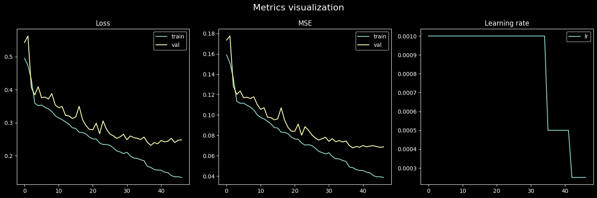
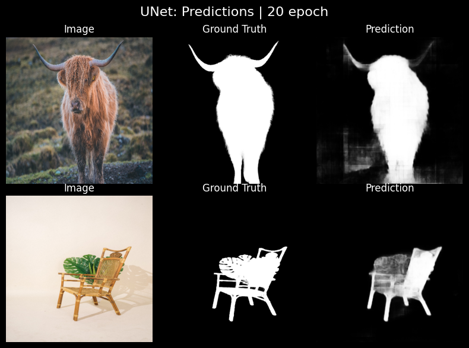
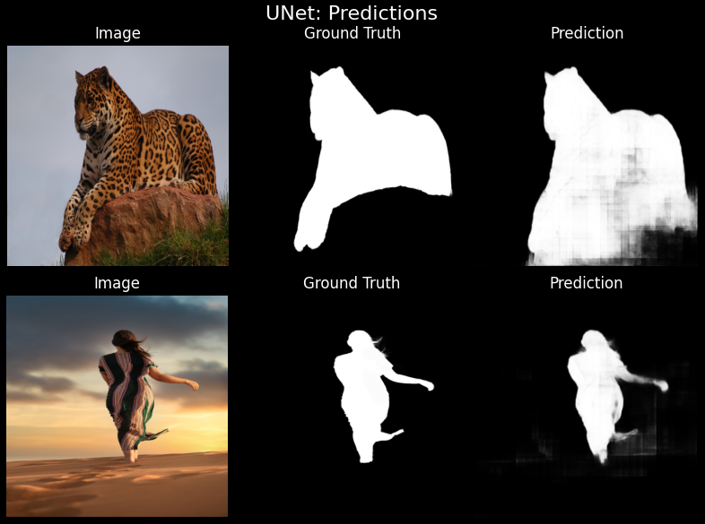
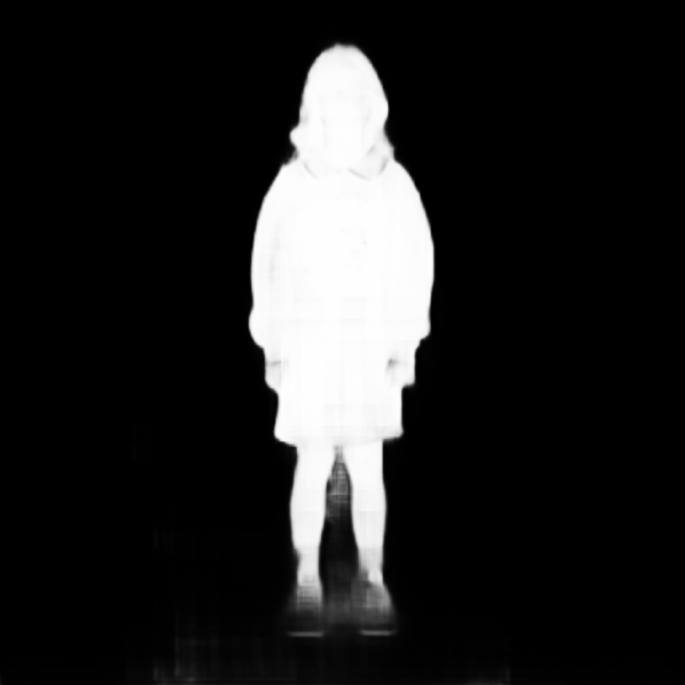

# Image Segmentation & Alpha Matting (U-Net)
Pipeline for precise object segmentation and alpha matting using **U-Net**.


## Key Features
- Segmentation pipeline for extracting precise object mattes  
- Trained on ~2500 images with augmentations, split into train/val/test  
- Fine-tuning on AIM-500 for improved accuracy and stable predictions  
- Achieved test_loss ≈0.23 and MSE ≈0.06  
- Interactive visualization of predictions, automatic saving of metrics and best model
- Quick evaluation and adaptation to new datasets  


## Tech Stack
- Python  
- PyTorch  
- Albumentations  
- OpenCV  
- Matplotlib  
- Numpy
- Scikit-learn
- Pillow
- Click


## Motivation
This project was built to explore practical image segmentation and alpha matting
using U-Net, with a focus on training stability, fine-tuning, and real-world
generalization to unseen data.


## Workflow
1. **Data Preparation**  
   - Images and ground-truth masks loaded from dataset directories.  
   - Applied augmentations: resizing, flips, affine transforms, brightness/contrast, normalization.  

2. **Training**  
   - Standard U-Net trained on ~2500 images for segmentation.  
   - Loss: BCEWithLogitsLoss, metrics: MSE.  
   - Early stopping and automatic saving of best model implemented.  

3. **Fine-Tuning**  
   - Fine-tuned on AIM-500 dataset for improved accuracy.  
   - Reduced learning rate, early stopping, automatic best-model saving.  

4. **Evaluation**  
   - Metrics: test_loss ≈0.23, MSE ≈0.06.  
   - Visualization of predictions vs ground-truth.  
   - Quick adaptation to new datasets with the same pipeline.  

5. **Inference**  
   - Predict segmentation masks on new images using trained or fine-tuned models.  
   - Generates alpha mattes for downstream applications. 


## Example Results  

### Training Metrics
Training and validation dynamics during initial training and fine-tuning.
Loss, MSE, and learning rate curves were logged automatically.


### Test Results (Seen Distribution)
Qualitative comparison of segmentation results on the test split.

<h4 align="center">Before Fine-Tuning (Initial Training)</h4>
<p align="center">
  
</p>

<h4 align="center">After Fine-Tuning (AIM-500)</h4>
<p align="center">
  
  
</p>

### Generalization to Unseen Data
Evaluation on a separate dataset of ~100 images not seen during training or fine-tuning.
Results vary depending on object complexity and background conditions.

<h4 align="center">Below are selected examples where the model demonstrates reasonable generalization:</h4>
<p align="center">
  
  
  
</p>

Full inference results on unseen data are available in `test_predictions/`.

### Quantitative Results

| Stage                | Dataset        | Loss ↓ | MSE ↓ |
|----------------------|----------------|--------|-------|
| Initial Training     | Test split     | ~0.23  | ~0.06 |
| Fine-Tuning (AIM-500)| Test split     | ~0.19  | ~0.04 |


## Project Structure

```
image-segmentation-alpha-matting/
|   .gitignore                # Git ignore file
|   infer.py                   # Inference script
|   train.py                   # Training script
|   setup.py
|   README.md                  # Project README
|   requirements.txt           # Python dependencies
|
+---artifacts                  # Trained models and metrics
|   +---best_models
|   |   +---finetune
|   |   |       FT_best_model_13epoch.pt
|   |   |
|   |   \---train
|   |           best_model_38epoch.pt
|   |
|   \---metrics
|       +---finetune
|       \---train
|               metrics.pt
|
+---assets                     # Images and predictions for visualization
|   |   TestResAfterFT.png
|   |   TestResBeforeFT.png
|   |   training_metrics.png
|   |   TrainResAfterFT.png
|   |
|   \---test_predictions       # Sample predicted masks
|           0001.png
|           0002.png
|           ...
|           0100.png
|
+---configs                    # Configurations for training and fine-tuning
|       config.py
|
+---data                       # Input datasets
|       test_image.jpg         # test image for inference 
|
|   \---AIM-500-dataset
|   \---duts-dataset
|                       
|   \---test_dataset
|           0001.png
|           0002.png
|           ...
|           0100.png
|
+---notebooks                  # Jupyter notebooks
|       main.ipynb             # Demo notebook with training and inference
|
+---outputs
|       test_mask.png          # test output mask after inference
|
\---src                        # Source code for models, datasets, and training
    |   utils.py               # Utility functions
    |
    |   inference_utils.py
    |
    +---datasets
    |       datasets.py        # Dataset classes
    |
    +---metrics
    |       mse_metric.py      # Metric calculation
    |
    +---models
    |       unet.py            # UNet architecture
    |
    \---training
            callbacks.py       # Early stopping, scheduler callbacks
            loops.py           # Training and evaluation loops
```

---


## Installation
```bash
git clone https://github.com/VorokAzamatov/image-segmentations-alpha-matting.git
cd image-segmentation-alpha-matting
pip install -r requirements.txt
```

## Usage

### Inference with CLI
Run inference on a single image using the trained model:

```bash
python infer.py \
    -i "path/to/input_image.jpg" \
    -w "path/to/model_weights.pt" \
    -o "path/to/output_mask.png" \
    -d "cuda" \
    --img_size 512
```


## Notes
- Pre-trained models are stored in `artifacts/best_models/`.  
  Only the best models are uploaded due to size limitations.
- Designed for quick evaluation, visualization, and adaptation to new datasets.
- The model was trained on relatively small datasets and may require further fine-tuning for new domains.


