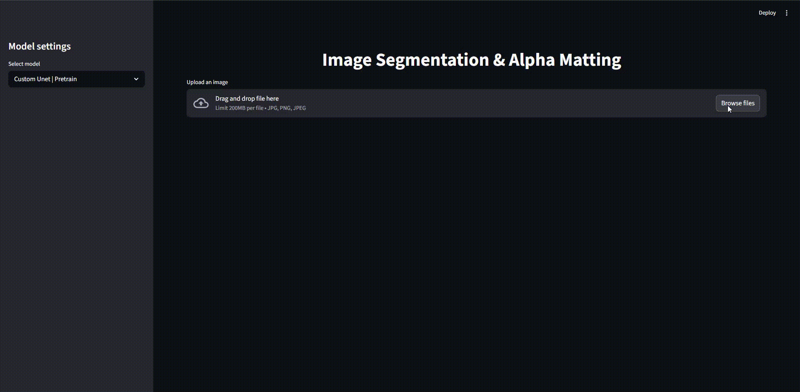
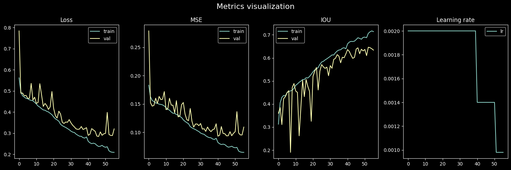
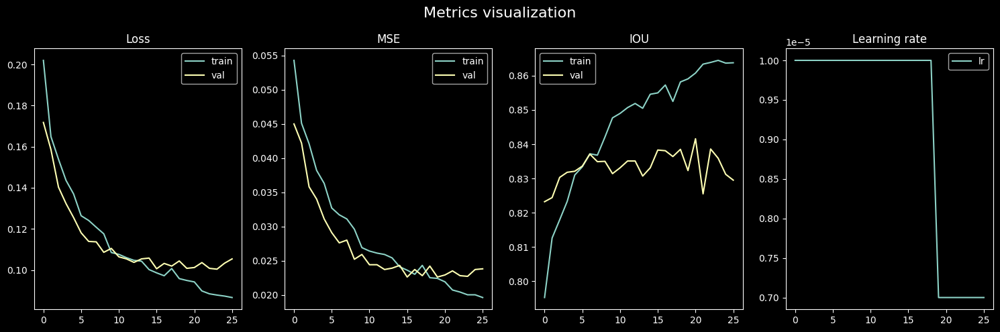
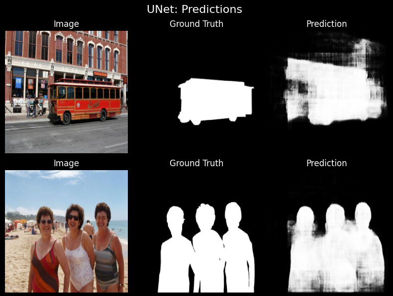
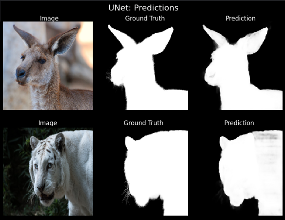
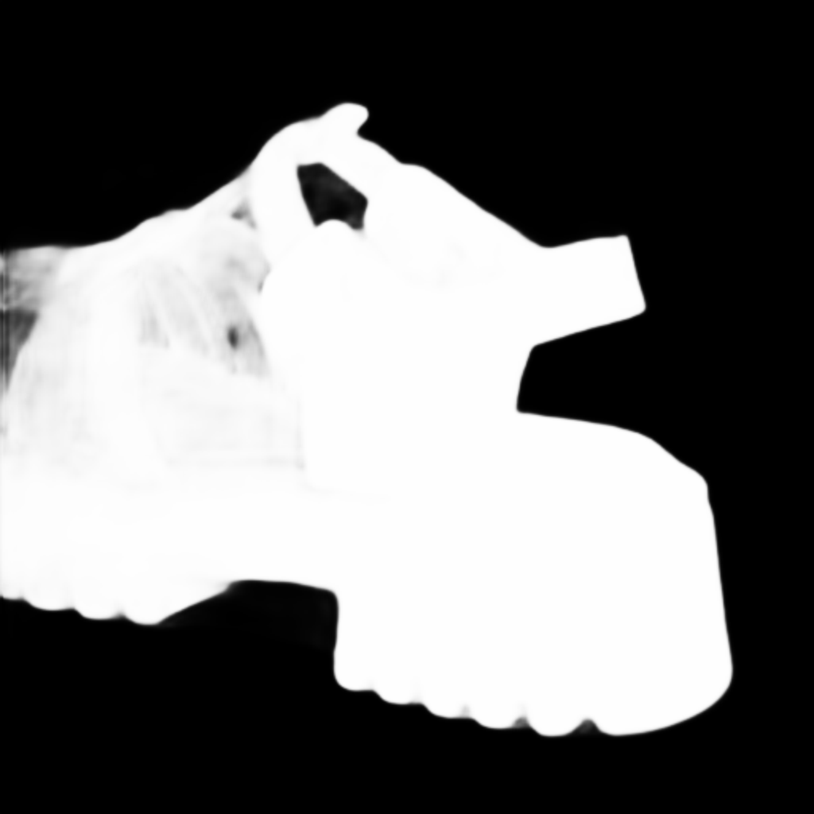
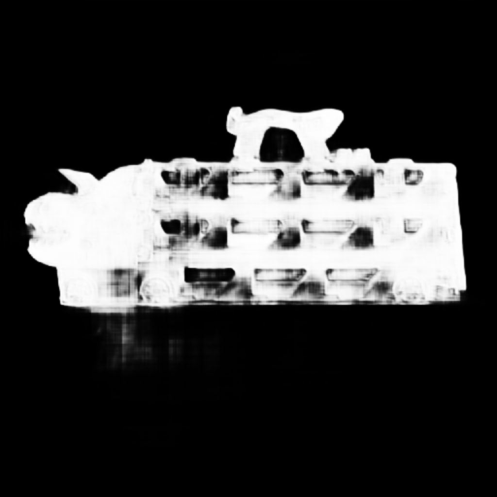
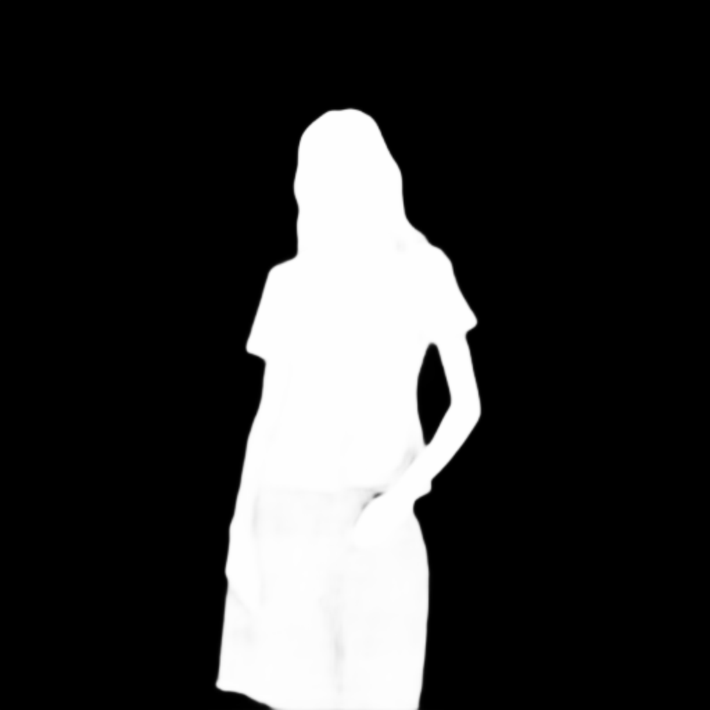

# Image Segmentation & Alpha Matting (U-Net)


End-to-end computer vision pipeline for object segmentation and alpha matting using U-Net architectures.  
Includes model training, experiment tracking, CLI inference, and an interactive Streamlit web application.

## Demo

Example of real-time segmentation using the Streamlit web application.

<p align="center">
  
</p>

## Key Features
- End-to-end segmentation pipeline from training to deployment
- Custom U-Net architecture implemented from scratch
- Support for both custom U-Net and `segmentation_models_pytorch` U-Net
- Training pipeline with modular dataset, metrics, and training loops
- Experiment tracking with MLflow
- CLI interface for model training and inference
- Interactive Streamlit web application for real-time predictions
- Post-processing tools (thresholding, blur, morphology, contours)
- Mask overlay visualization and result export
- Modular and scalable project structure


## Tech Stack
- Python
- PyTorch
- segmentation_models_pytorch
- Albumentations
- OpenCV
- NumPy
- Pillow
- Streamlit
- MLflow
- Click


## Requirements
   - Python >=3.10
   - CUDA (optional for GPU training)

## Quick Start

Clone the repository and install dependencies:
```bash
git clone https://github.com/VorokAzamatov/image-segmentations-alpha-matting.git
cd image-segmentation-alpha-matting
pip install -r requirements.txt
```

## Usage
### Inference with CLI
Run inference on a single image using the trained model:

```bash
python infer.py \
    -mt "model_type" # 'custom_unet' / 'smp_unet'
    -i "path/to/input_image.jpg" \
    -w "path/to/model_weights.pt" \
    -o "path/to/output_mask.png" \
    -d "cuda" \
    --img_size 512
```
### Web Application
An interactive web interface built with **Streamlit** allows real-time model inference.

Features:

- Upload images for segmentation
- Adjustable post-processing parameters
- Mask visualization
- Mask overlay on the original image
- Download predicted masks

#### Run the web application:

```bash
streamlit run app/app.py
```


## Workflow
1. **Data Preparation**  
   - Images and ground-truth masks loaded from dataset directories.  
   - Applied augmentations: resizing, flips, affine transforms, brightness/contrast, normalization.  

2. **Training**  
   - Custom U-Net and SMP U-Net models
   - Data augmentation with Albumentations
   - BCE + Dice loss
   - Metrics: IoU, MSE
   - Early stopping and learning rate scheduling
   - Experiment tracking with MLflow 

3. **Fine-Tuning**  
   - Fine-tuned on AIM-500 dataset for improved accuracy.  
   - Reduced learning rate, early stopping, automatic best-model saving.  

4. **Evaluation**  
   - Metrics: Loss, MSE, and IoU were used for evaluation. 
   - Visualization of predictions vs ground-truth.  
   - Quick adaptation to new datasets with the same pipeline.  

5. **Inference**  
   - Predict segmentation masks on new images using trained or fine-tuned models.  
   - Generates alpha mattes for downstream applications. 


## Example Results  
### Metrics
Training and validation dynamics during initial training and fine-tuning.
Loss, MSE, and learning rate curves were logged automatically.
#### Training Metrics


#### Fine-tuning Metrics


### Images during training
<h4 align="center"></h4>
<p align="center">
   
   
</p>


### Generalization to Unseen Data
Evaluation on a separate dataset of ~100 images not seen during training or fine-tuning.

<h4 align="center">Below are selected examples where the model demonstrates reasonable generalization:</h4>
<p align="center">
  
  
  
</p>

Full inference results on unseen data are available in `assets/test_predictions/`.

---

### Qualitative Results
Comparison of model predictions before and after fine-tuning.

| Stage                | Dataset        | Loss ↓ | MSE ↓ | IoU ↑ | Model type |
|----------------------|----------------|--------|-------|-------|------------|
| Initial Training     | Test split     | ~0.23  | ~0.07 | ~0.69 | Custom UNet|
| Fine-Tuning (AIM-500)| Test split     | ~0.17  | ~0.06 | ~0.76 | Custom UNet|
| Initial Training     | Test split     | ~0.07  | ~0.02 | ~0.90 |  SMP UNet  |
| Fine-Tuning (AIM-500)| Test split     | ~0.19  | ~0.04 | ~0.80 |  SMP UNet  |


## Project Structure

```
├── app/              # Streamlit web application
├── artifacts/        # Trained models and experiment outputs
├── assets/           # Images and visualizations for README
├── configs/          # Training configurations
├── data/             # Datasets
├── notebooks/        # Experiments and exploration
├── src/              # Source code
│   ├── data/
│   ├── inference/
│   ├── metrics/
│   ├── models/
│   ├── training/
│   └── utils/
├── infer.py          # CLI inference script
├── train.py          # Training script
```

---


## Future Improvements

- Add transformer-based segmentation models
- Improve alpha matting quality
- Deploy the model with FastAPI
- Add model quantization for faster inference
- Extend training to larger datasets
- Extend the functionality of the web application

## Notes
- Pre-trained models are stored in `artifacts/best_models/`.  
  Only the best models are uploaded due to size limitations.
- Designed for quick evaluation, visualization, and adaptation to new datasets.
- The model was trained on relatively small datasets and may require further fine-tuning for new domains.